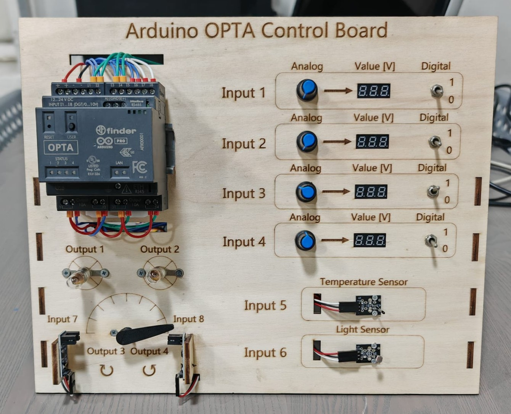
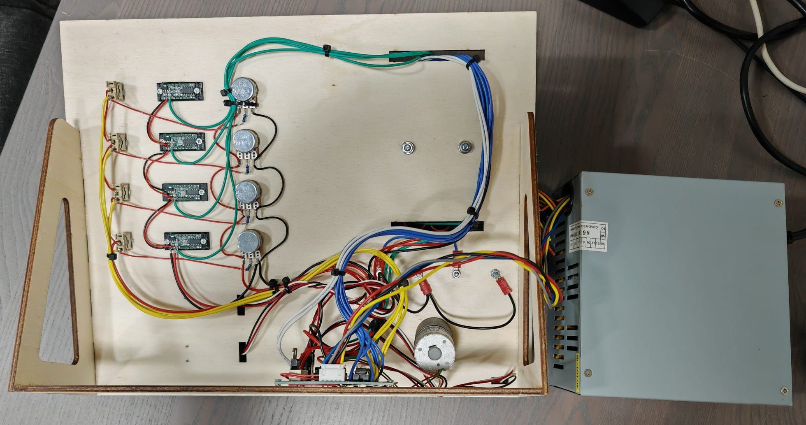

# OPTA Control Board

## Descrizione

Il progetto riguarda la realizzazione di una interfaccia hardware denominata **OPTA Control Board**, progettata per facilitare l’utilizzo e la sperimentazione con il PLC **Arduino OPTA**.

La scheda integra ingressi e uscite, sensori e attuatori, offrendo una piattaforma compatta per test, dimostrazioni e sviluppo di logiche di controllo.

---

## Architettura del sistema

La OPTA Control Board è composta dai seguenti elementi:

* **2 uscite digitali** collegate a lampadine
* **2 uscite digitali** dedicate al controllo di un motore (gestione del verso di rotazione)
* **4 ingressi analogici/digitali**, inclusi:

  * potenziometro
  * indicatore di tensione
* **2 ingressi aggiuntivi** per sensori:

  * sensore di temperatura
  * sensore di luce

L’intero sistema è alimentato tramite un **alimentatore da PC riutilizzato**, garantendo una soluzione economica e facilmente reperibile.

---

## Vista del dispositivo

  
  

---

## Struttura della repository

### /3D Models

Contiene la progettazione meccanica completa della struttura:

* modelli 3D realizzati in SolidWorks
* file per stampa 3D
* file per taglio laser

---

### /KiCad

Contiene lo schema elettrico delle connessioni presenti sul retro della struttura, utilizzato per la realizzazione del cablaggio e della distribuzione dei segnali.

---

## Note

La repository documenta lo sviluppo della scheda e la sua architettura, con finalità dimostrative e di supporto alla prototipazione di sistemi basati su PLC Arduino.
